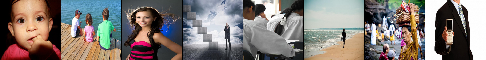
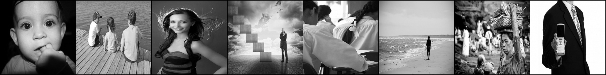
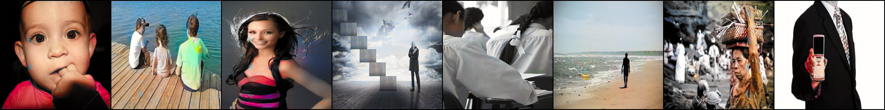

# Pix2Pix Image Colorizer


Original Images

Black and White

Model Predictions


This project implements the Pix2Pix paper to create a model that converts black and white images to color. It's based on the research paper ["Image-to-Image Translation with Conditional Adversarial Networks"](https://arxiv.org/abs/1611.07004) by Phillip Isola, Jun-Yan Zhu, Tinghui Zhou, and Alexei A. Efros.

## Table of Contents
- [Overview](#overview)
- [Requirements](#requirements)
- [Installation](#installation)
- [Usage](#usage)
- [Training](#training)
- [Model Architecture](#model-architecture)
- [Results](#results)
- [Contributing](#contributing)
- [License](#license)
- [Acknowledgements](#acknowledgements)

## Overview

This implementation uses a conditional Generative Adversarial Network (cGAN) to learn a mapping from input black and white images to output colorized images. The model is trained on paired data, where each pair consists of a black and white image and its corresponding color version.

## Requirements

- Python 3.7+
- PyTorch 1.7+
- torchvision
- numpy
- Pillow
- tqdm

## Installation

1. Clone this repository:
   ```
   git clone https://github.com/ivanrj7j/Pix2Pix-Image-Colorizer.git
   cd Pix2Pix-Image-Colorizer
   ```

2. Install the required packages:
   ```
   pip install -r requirements.txt
   ```

## Usage

To colorize a black and white image:

```python
>>> from main import colorizeImage
>>> colorizeImage("path/to/image", True, "path/to/output/")
```

## Model Architecture

### Generator

The generator follows a U-Net-like architecture with skip connections:

- Initial downsampling layer
- 6 downsampling blocks
- Bottleneck layer
- 7 upsampling blocks with skip connections
- Final layer to produce the colorized image

Each downsampling block consists of:
- Convolutional layer
- Batch normalization
- LeakyReLU activation

Each upsampling block consists of:
- Transposed convolutional layer
- Batch normalization
- ReLU activation
- Dropout (in the first 3 blocks)

### Discriminator

The discriminator follows a PatchGAN architecture:

- Initial convolutional layer with LeakyReLU
- 3 discriminator blocks
- Final convolutional layer

Each discriminator block consists of:
- Convolutional layer
- Batch normalization
- LeakyReLU activation

For the complete architecture details, please refer to the `models.py` file in the repository.

## Results

These results demonstrate the effectiveness of our Pix2Pix implementation in converting black and white images to color. While the generated images may not always perfectly match the original colors, they provide a plausible and visually appealing colorization.

## Contributing

Contributions are welcome! Please feel free to submit a Pull Request.

## License

This project is licensed under the MIT License - see the [LICENSE](LICENSE) file for details.

## Acknowledgements

- [Pix2Pix paper](https://arxiv.org/abs/1611.07004) by Phillip Isola, Jun-Yan Zhu, Tinghui Zhou, and Alexei A. Efros
- [PyTorch](https://pytorch.org/) team for their excellent deep learning framework
- [Machine Learning Collection](https://github.com/aladdinpersson/Machine-Learning-Collection) by Aladdin Persson, specifically the [ML/Pytorch/GANs](https://github.com/aladdinpersson/Machine-Learning-Collection/tree/master/ML/Pytorch/GANs) section, which provided valuable insights and implementation details
- [Aladdin Persson's YouTube channel](https://www.youtube.com/@AladdinPersson) for educational content on machine learning and deep learning techniques